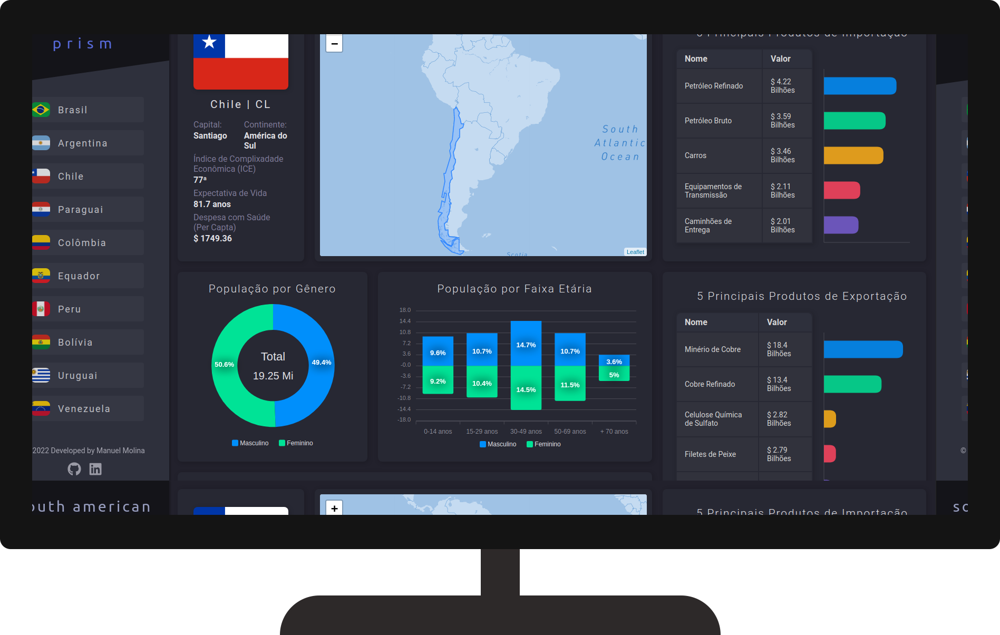

<h1 align="center">
   South America Prism | Desenvolvimento Pessoal
</h1>

<br/>

## 💻 Projeto
 Estou fazendo esse projeto com o intuito aprimorar alguns conhecimentos adquiridos nos últimos meses de estudo, esta aplicação é uma SPA (Single Page Application) que oferece um prisma econômico, social e territorial de 10 países da América Latina. A proposta é trazer uma análise de fácil compreensão, interativa e com alguns níveis de detalhamento nos dados apresentados.

## 🔖 Layout
 Estou desenhando o layout através do Figma e você pode visualizar [clicando aqui](https://www.figma.com/file/9MydleVH9P9a8WDbxstUMZ/South-America-Prism?node-id=0%3A1)

 <h1 align="center">
    
</h1>


 ## 🚀 Tecnologias

- [NextJS](https://nodejs.org/en/)
- [ReactJS](https://reactjs.org)
- [Typescript](https://www.typescriptlang.org/)
- [Scss](https://sass-lang.com/)

### 📡 Ferramentas Complementares

- [Axios](https://axios-http.com/)
- [Apex Charts](https://apexcharts.com/)
- [Eslint](https://eslint.org/)
- [Leaflet](https://leafletjs.com/)

<br/>


## 🤔 Como posso visualizar o projeto?

- Para acessar o projeto online [clique aqui!](https://searches-nextjs-project.vercel.app/) 

- Para instalar localmente, siga os passos abaixo:

<br/>

```sh
git clone https://github.com/ManuelMolina02/searches-nextjs-project.git
```

Após baixar o projeto, acesse o repositório via terminal e execute os seguintes comandos:

```sh
npm install
npm run dev
```

<br/>
<br/>

Feito com 💜 por Manuel Molina 👋 Me contate através do [LinkedIn!](https://www.linkedin.com/in/manuel-angel-berger-molina-ba08b3174/)

