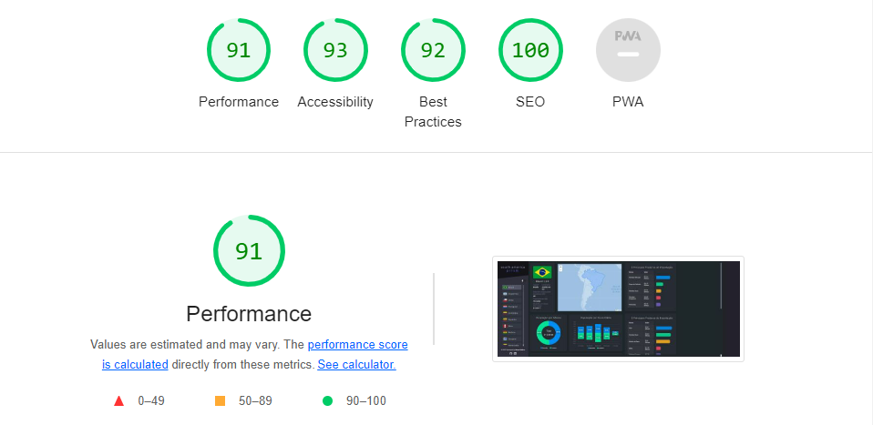

<h1 align="center">
   South America Prism | Desenvolvimento Pessoal
</h1>

<br/>

## 🤖 Sobre

Esse projeto foi feito depois que terminei o módulo 3 da trilha reactJS, por ser um período que mergulhei em muita informação, entendi que seria importante fazer um projeto do zero, simplesmente para interagir com uma situação diferente do que estava estudando, então a ideia era basicamente ter um tema para pesquisar, criar uma estrutura de dados e representar essas informações de alguma forma.

<br/>

## 💻 Projeto

South America Prism é o projeto que demonstra um conjunto de dados socioeconômicos de 10 países da América do Sul, os dados são acessados através de algumas APIs. A proposta é basicamente trazer uma análise de fácil compreensão, interativa e com alguns níveis de detalhamento nos dados apresentados.
<br/>

Obs: os dados da aplicação utilizam um recurso do github, que é gratuito e hospeda arquivos html, md, json, entre muitos outros formatos, para saber mais sobre o essa opção é só acessar o link na sessão de tecnologias.

## 🔖 Layout

 <h1 align="center">
    
</h1>

 <h1 align="center">
    
</h1>

## 🚀 Tecnologias

- [NextJS](https://nodejs.org/en/)
- [ReactJS](https://reactjs.org)
- [Typescript](https://www.typescriptlang.org/)
- [Scss](https://sass-lang.com/)

### 🌌 Ferramentas Complementares

- [Axios](https://axios-http.com/)
- [Apex Charts](https://apexcharts.com/)
- [Leaflet](https://leafletjs.com/)
- [Eslint](https://eslint.org/)


### 📡 Outros Conteúdos 
- [Theme (Dark/ Light)](https://apexcharts.com/)
- [Github Pages](https://pages.github.com/)
- [Próximos passos!](https://leafletjs.com/)

<br/>

## 🤔 Como posso visualizar o projeto?

- Para acessar o projeto online [clique aqui!](https://south-america-prism.vercel.app/)

- Para instalar localmente, siga os passos abaixo:

<br/>

```sh
git clone https://github.com/ManuelMolina02/searches-nextjs-project.git
```

Após baixar o projeto, acesse o repositório via terminal e execute os seguintes comandos:

```sh
npm install
npm run dev
```

<br/>
<br/>

Feito com 💜 por Manuel Molina 👋 Me contate através do [LinkedIn!](https://www.linkedin.com/in/manuel-angel-berger-molina-ba08b3174/)
